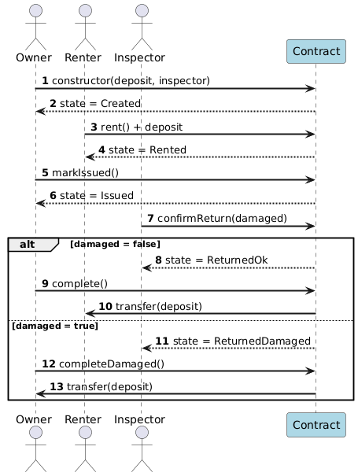

# SportRent – Sporto Inventoriaus Nuomos Sutartis

**Laboratorinis darbas Nr. 4** · Blockchain · Ethereum · Solidity

---

## 1. Trumpas aprašymas

Šiame projekte sukūriau išmaniąją sutartį sporto inventoriaus nuomos depozito mokėjimui. Naudojau **escrow** logiką - saugų atsiskaitymą per smart contract, kad nei savininkas, nei nuomininkas nerizikuotų prarasti pinigų ar inventoriaus.

**Realaus pasaulio panaudojimo atvejai:**
- ⛷️ **Slidinėjimo įrangos nuoma** slidinėjimo kurorte
- 🏄 **Banglentių nuoma** atostogų metu paplūdimyje
- 🚴 **Dviračių nuoma** turistams mieste
- 🎾 **Teniso rakės nuoma** turnyrui ar treniruotei

Sutartį testavau **Remix** aplinkoje ir paruošiau deploy'inimui į **Sepolia testnet**. Pridėjau **DApp** su MetaMask integracija.

---

## 2. Verslo modelis

### Pagrindiniai veikėjai

| Rolė | Atsakomybės |
|------|-------------|
| **Owner** | Inventoriaus savininkas. Sukuria nuomos pasiūlymą, išduoda inventorių, gauna kompensaciją jei sugadinta. |
| **Renter** | Nuomininkas. Sumoka depozitą, naudoja inventorių, gauna pinigus atgal jei grąžina tvarkingai. |
| **Inspector** | Nepriklausomas tikrintojas. Apžiūri grąžintą inventorių ir nusprendžia: tvarkingas ar sugadintas. |

### Tipiniai scenarijai

**Scenarijus A: Sėkmingas procesas**
1. Owner sukuria pasiūlymą (depozitas + inspector adresas)
2. Renter sumoka depozitą → pinigai užšąla contract'e
3. Owner išduoda inventorių (pvz., teniso raketę)
4. Renter naudoja 3 dienas ir grąžina
5. Inspector apžiūri → viskas tvarkingas
6. Owner užbaigia → Renter gauna depozitą atgal ✅

**Scenarijus B: Sugadintas inventorius**
1-4. [Kaip Scenarijus A]
5. Inspector apžiūri → randa pažeidimą
6. Owner užbaigia → Owner gauna depozitą kaip kompensaciją ❌

---

## 3. Sekų diagrama


Pqarašiau PlantUML kodą ir generavau su: https://plantuml.com/

### Sekų aprašymai:

**Seka 1: Deploy**
- Owner iškviečia `constructor()` su depozito suma ir inspector adresu
- Contract išsaugo parametrus ir nustato `state = Created`

**Seka 2: Nuoma**
- Renter iškviečia `rent()` ir sumoka depozitą
- Contract patikrina sumą, išsaugo Renter adresą, nustato `state = Rented`
- ETH užrakinama contract balance

**Seka 3: Išdavimas**
- Owner fiziškai išduoda inventorių Renter'iui
- Owner iškviečia `markIssued()` → `state = Issued`

**Seka 4: Grąžinimas**
- Renter fiziškai grąžina inventorių
- Inspector apžiūri būklę ir iškviečia `confirmReturn(damaged)`
- Jei `damaged = false` → `state = ReturnedOk`
- Jei `damaged = true` → `state = ReturnedDamaged`

**Seka 5: Užbaigimas**
- Jei ReturnedOk: Owner iškviečia `complete()` → contract perveda depozitą Renter'iui
- Jei ReturnedDamaged: Owner iškviečia `completeDamaged()` → contract perveda depozitą Owner'iui
- `state = Completed`

---

## 4. Smart Contract (SportRent.sol)

**Failas:** `contracts/SportRent.sol`

**Pagrindinės funkcijos:**
- `constructor(deposit, inspector)` – sukuria pasiūlymą
- `rent()` – Renter sumoka depozitą
- `markIssued()` – Owner patvirtina išdavimą
- `confirmReturn(damaged)` – Inspector tikrina būklę
- `complete()` – grąžina depozitą Renter (jei OK)
- `completeDamaged()` – perveda depozitą Owner (jei sugadinta)

**Būsenos:**
```
Created → Rented → Issued → ReturnedOk/ReturnedDamaged → Completed
```

---

## 5. Lokalus testavimas (Remix)

Testavau kontraktą **Remix IDE** su **JavaScript VM**:

### 5.1 Deploy

Sutarties diegimas su Owner, Inspector ir Renter vaidmenimis.

**Konfiguracijos:**


**Inspector pasirinktas 2 account:**


**Contract sėkmingas:**


### 5.2 rent() – Depozito mokėjimas

**Mokėjimas sėkmingas:**


**Nuomininkas sumokėjo 1 ETH depozitą:**


### 5.3 markIssued() – Išdavimo patvirtinimas

Savininkas patvirtina, kad inventorius išduotas.
**Patvirtinimas sėkmingas: **


### 5.4 confirmReturn() – Inspektoriaus tikrinimas

#### Scenarijus 1: Inventorius tvarkingas ✅

Inspektorius patvirtina, kad inventorius grąžintas be pažeidimų (damaged = false).

**confirmReturn(false) iškvieta:**


**Transakcija sėkminga:**


### 5.5 complete() – Depozito grąžinimas nuomininkui

#### Scenarijus 1: Depozito grąžinimas ✅

Kai inventorius tvarkingas, nuomininkas gauna pinigus atgal.

**complete() iškvieta:**


**Rezultatas:** Renter atgavo 1 ETH depozitą


### 5.6 completeDamaged() – Pinigų grąžinimas savininkui

#### Scenarijus 2: Inventorius sugadintas ❌

Kai inventorius sugadintas, savininkas gauna pinigus kaip kompensaciją.

**confirmReturn(true) iškvieta:**


**completeDamaged() iškviesta sėkmingai:**


**Rezultatas:** Owner gavo 1 ETH kompensaciją, Renter neatgavo


---

## 6. Sepolia testnet deployment

Po lokalaus testavimo deploy'inau į **Sepolia testnet**:

**Procesas:**
1. MetaMask perjungimas į Sepolia
2. Test ETH gavimas: https://sepolia-faucet.pk910.de/
3. Remix → Injected Provider
4. Deploy ir funkcijų iškvietimas
5. Patikrinimas Etherscan'e

---

## 7. Etherscan logai

Visos transakcijos matomos Etherscan'e:


---

## 8. DApp (Front-End)

Sukūriau minimalistinį `index.html` failą, kuris leidžia:
- Prisijungti per MetaMask
- Įvesti contract'o adresą
- Iškviesti funkcijas: `rent()`, `markIssued()`, `confirmReturn()`, `complete()`


**Technologijos:**
- MetaMask
- ethers.js
- HTML + JavaScript

---

## 9. Kaip paleisti

### Smart Contract:
1. Atidaryti **Remix IDE** → https://remix.ethereum.org
2. Įkelti `contracts/SportRent.sol`
3. Compile (Solidity 0.8.x)
4. Deploy:
   - **JavaScript VM** – lokalus testavimas
   - **Sepolia** – per MetaMask

### DApp:
1. Atidaryti `index.html` naršyklėje
2. Connect Wallet (MetaMask)
3. Įvesti contract'o adresą
4. Naudotis funkcijomis


